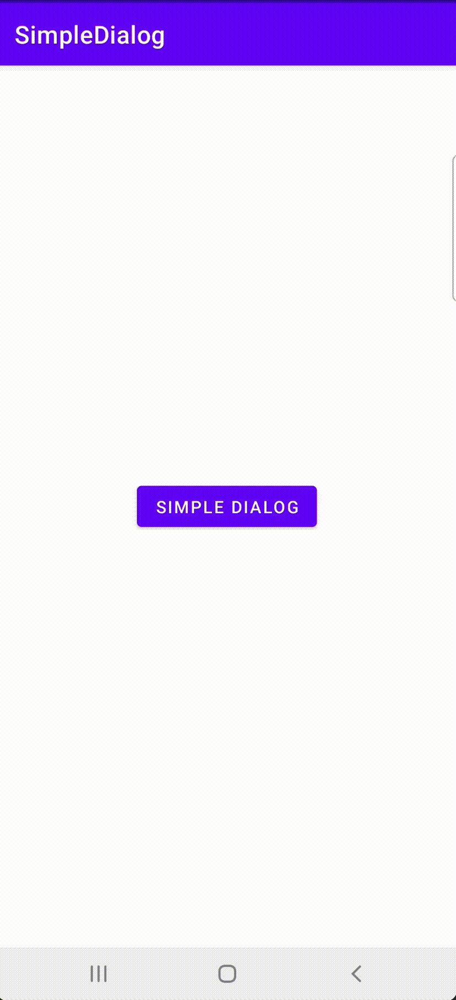

# SimpleDialog

Let’s create simple, re-useable dialog. My target is give the icon, title, description, and button labels while creating the dialog and register button click listeners. So you can use same dialog with different text and functionalities.
You can find medium article here =>

